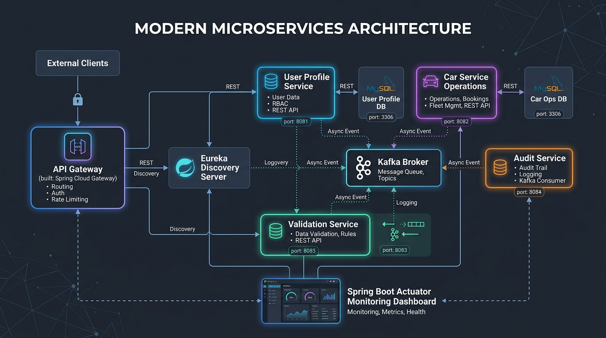

# Car Operations Management System

A highly resilient, secure, and modern microservices-based Car Service Management System. The application manages vehicle service registrations, role-based workflows (Admin, Mechanic, Customer), real-time Kafka auditing, service-level security, and displays live health metrics through an Admin Actuator Dashboard and modern glassmorphic frontend interface.

---

## 🎨 System Architecture Diagram



### Architectural Flow & Components

```mermaid
graph TD
    subgraph Client Layer
        UI[Web Frontend Dashboard]
    end

    subgraph Edge Layer
        GW[API Gateway :8765<br/>(JWT Auth, RBAC, CORS, Swagger Aggregator)]
    end

    subgraph Service Discovery
        EUK[Eureka Discovery Server :8761]
    end

    subgraph Core Microservices Layer
        UP[User Profile Service :8081<br/>(Service-Level JWT Security Filter)]
        OPS[Car Service Operations :8082<br/>(Service-Level JWT Security Filter)]
        VAL[Car Details Validation Service :8083<br/>(Service-Level JWT Security Filter)]
        AUD[Audit Logging Service :8084<br/>(Service-Level JWT Security Filter)]
    end

    subgraph Persistence Layer
        DB_UP[(carservice_user_db)]
        DB_OPS[(carservice_ops_db)]
        DB_AUD[(carservice_audit_db)]
    end

    subgraph Event Streaming
        KFK[Apache Kafka Broker :9092<br/>(Topic: car-service-audit-events)]
    end

    subgraph Actuator Health Monitoring
        ACT[Admin Actuator Panel<br/>(Live Status Cards & JSON Explorer)]
    end

    %% Routing & Client Interactions
    UI -->|HTTP Requests| GW
    GW -->|Route /users| UP
    GW -->|Route /carservice| OPS
    GW -->|Route /audits| AUD

    %% Discovery
    UP -.->|Register & Heartbeat| EUK
    OPS -.->|Register & Heartbeat| EUK
    VAL -.->|Register & Heartbeat| EUK
    AUD -.->|Register & Heartbeat| EUK
    GW -.->|Lookup Microservices| EUK

    %% Inter-Service Communication via OpenFeign
    OPS -->|OpenFeign: Verify Customer| UP
    OPS -->|OpenFeign: Validate Plate Format| VAL

    %% Event-Driven Auditing via Kafka
    OPS -->|Publish Audit Event| KFK
    KFK -->|Consume Audit Event| AUD

    %% Persistence
    UP --> DB_UP
    OPS --> DB_OPS
    AUD --> DB_AUD

    %% Actuator Monitoring
    UI -.->|Monitor /actuator/health| ACT
    ACT -.->|Poll Health & Metrics| GW
    ACT -.->|Poll Direct Actuators| UP
    ACT -.->|Poll Direct Actuators| OPS
    ACT -.->|Poll Direct Actuators| VAL
    ACT -.->|Poll Direct Actuators| AUD
    ACT -.->|Poll Direct Actuators| EUK
```

---

## 🛠️ Technology Stack

### Backend Services
* **Java 21 (JDK 21)**
* **Spring Boot (v3.3.1)**
* **Spring Cloud Routing & Gateway (MVC)**
* **Spring Cloud Netflix Eureka Discovery Server**
* **Spring Cloud OpenFeign (Declarative Synchronous REST Clients)**
* **Spring Boot Starter Actuator (Production-grade Monitoring & Management)**
* **Spring Data JPA & Hibernate ORM**
* **MySQL Database 8.0**
* **Apache Kafka 3.7 & ZooKeeper (Event-Driven Asynchronous Logging & Auditing)**
* **Springdoc OpenAPI 3 (Swagger UI Aggregator)**
* **JJWT 0.12.5 (Java JWT for Security, Verification & Authorization)**

### Frontend Application
* **HTML5 & Vanilla CSS3** (Dark-themed Glassmorphism Design System)
* **Vanilla JavaScript** (Reactive State Management, Actuator Explorers & Dynamic State Rendering)
* **FontAwesome 6.4.0** (Icons)

---

## 🧩 Microservices Overview

The application comprises **6 independent, container-ready Maven microservices**:

| Microservice | Port | Database / Tech | Core Responsibilities |
| :--- | :---: | :--- | :--- |
| **`eureka-discovery-server`** | `8761` | Eureka Server | Central service registry & active instance cluster tracking |
| **`api-gateway`** | `8765` | Gateway MVC, JJWT | Single entry point, JWT validation, RBAC, CORS handling & Swagger UI aggregator |
| **`user-profile-service`** | `8081` | MySQL (`carservice_user_db`) | User/Customer/Mechanic/Admin profiles, password hashing, seeder |
| **`car-service-operations`** | `8082` | MySQL (`carservice_ops_db`), OpenFeign, Kafka Producer | Core business engine, vehicle service bookings, status transitions & audit publishing |
| **`car-details-validation-service`** | `8083` | Regex Engine | Validates license plate formats (`^[A-Z]{2}[0-9]{1,2}[A-Z]{1,2}[0-9]{4}$`) |
| **`audit-service`** | `8084` | MySQL (`carservice_audit_db`), Kafka Consumer | Asynchronously consumes audit logs from Kafka and saves persistent history |

---

## 🔒 Dual-Layer Security Architecture

The application implements a robust **Dual-Layer Defense-in-Depth Security Model**:

```
[ Client Request ] ──► [ Layer 1: Edge Gateway Filter ] ──► [ Layer 2: Service-Level Filter ] ──► [ Business Logic ]
```

### Layer 1: Edge Gateway Security (`api-gateway`)
* **`JwtAuthenticationFilter`**: Intercepts all incoming client requests at port `8765`.
* **JWT Signature & Expiration Check**: Verifies cryptographic signatures (`HMAC-SHA256`) and checks token freshness.
* **Role-Based Access Control (RBAC)**: Enforces endpoints based on claims (`ROLE_ADMIN`, `ROLE_MECHANIC`, `ROLE_CUSTOMER`).
* **Header Injection**: Extracts token payload and injects verified headers (`X-Authenticated-User`, `X-Authenticated-Role`, `X-Authenticated-Id`) downstream.

### Layer 2: Service-Level Security (`ServiceSecurityFilter`)
* Implemented via custom `ServiceSecurityFilter` and `JwtUtil` across downstream microservices (`user-profile-service`, `car-service-operations`, `audit-service`, `car-details-validation-service`).
* **Direct Access Rejection**: Rejects any direct request bypassing the Gateway without a valid `Authorization: Bearer <token>` or Gateway context header with **`HTTP 401 Unauthorized`**:
  ```text
  Service-Level Security: Unauthorized direct access attempt detected.
  ```
* **CORS Preflight Support**: Responds to HTTP `OPTIONS` preflight requests with `200 OK` and `Access-Control-Allow-Origin: *` for web dashboard integration.

---

## 📊 Health Monitoring & Actuator Dashboard

Spring Boot Actuator is integrated into **all 6 microservices** to provide full operational visibility:

### 1. Actuator Configuration
Each service exposes management endpoints via `application.properties`/`application.yml`:
* Management Endpoint Exposure: `management.endpoints.web.exposure.include=*`
* Detailed Health Indicators: `management.endpoint.health.show-details=always`
* Component Monitoring: MySQL database status (`db`), Disk space (`diskSpace`), Service registry status (`discoveryComposite`), and Ping (`ping`).

### 2. Admin Health & Actuator Panel (Frontend UI)
Logged-in Admins have access to a dedicated **Health & Actuator** panel:
* **Live Service Status Cards**: Displays real-time 🟢 **UP** / 🔴 **DOWN** status badges for all 6 microservices.
* **Component Metrics Summary**: Displays database connection state, available disk storage, and discovery status.
* **Interactive Actuator JSON Explorer**: Embedded buttons to fetch raw payloads for:
  * `/actuator/health` — Complete health component tree
  * `/actuator/metrics` — JVM memory, thread count, CPU usage & HTTP stats
  * `/actuator/env` — Active profiles and environment properties
  * `/actuator/beans` — Spring application context dependency graph
  * `/actuator/mappings` — Exposed REST controller URL mappings

---

## 🔄 Inter-Service Communication

### 1. Synchronous Communication via Spring Cloud OpenFeign
* **`car-service-operations` ➔ `user-profile-service`**:
  Uses `@FeignClient(name = "user-profile-service")` to verify customer account validity (`/userprofile/verify-user/{userId}`) before creating a vehicle service booking.
* **`car-service-operations` ➔ `car-details-validation-service`**:
  Uses `@FeignClient(name = "car-details-validation-service")` to validate vehicle license plate syntax.

### 2. Asynchronous Communication via Apache Kafka
* **Event Topic**: `car-service-audit-events`
* **Producer**: `car-service-operations` publishes JSON audit payloads whenever a vehicle service log is created, updated, or deleted.
* **Consumer**: `audit-service` (Consumer Group: `audit-group`) consumes events asynchronously and persists them to `carservice_audit_db`.

---

## 👥 Role Permissions & Business Rules

### Database Isolation (Non-overlapping sequential IDs)
Users are isolated into dedicated MySQL tables:
* `admin_profiles` (Admin ID prefix: `ADM-`)
* `mechanic_profiles` (Mechanic ID prefix: `MCH-`)
* `customer_profiles` (Customer ID prefix: `USR-`)

Each table maintains an independent auto-increment sequence starting at `1` (`USR-1`, `MCH-1`, `ADM-1`).

### Permissions Matrix

| Action | Admin | Mechanic | Customer |
| :--- | :---: | :---: | :---: |
| **Create Service Record (POST)** | ✅ Yes | ❌ No | ❌ No |
| **Delete Service Record (DELETE)** | ✅ Yes | ❌ No | ❌ No |
| **View All Service Records (GET)** | ✅ Yes | ✅ Yes (Full Fleet) | ❌ No (Own Only) |
| **View Personal Logs (GET)** | ✅ Yes | ✅ Yes | ✅ Yes (Filtered) |
| **Update Service Status (PUT)** | ✅ Yes (Any State) | ✅ Yes (Active States) | ❌ No |
| **Revert COMPLETED Status** | ✅ Yes | ❌ No (Terminal Lock) | ❌ No |
| **Access Actuator Health Panel** | ✅ Yes | ❌ No | ❌ No |

### Completed State Terminal Lock
When a vehicle service is marked as `COMPLETED`:
* **Mechanics**: Read-only lock enforced. The status dropdown is replaced with a lock icon, and direct API calls return `403 Forbidden`.
* **Admins**: Retain override capabilities to revert status to `IN_PROGRESS` or `PENDING` if corrections are required.

---

## 🚀 Setup & Execution Guide

### 1. Prerequisites
* **JDK 21** installed and configured on `PATH`
* **MySQL 8.0** running on port `3306` (`username: root`, `password: root`)
* **Apache Kafka** & **ZooKeeper**

### 2. Start ZooKeeper & Apache Kafka
Open a terminal in your Kafka installation directory:

#### Windows (Command Prompt / PowerShell)
```cmd
# Terminal 1: Start ZooKeeper
.\bin\windows\zookeeper-server-start.bat .\config\zookeeper.properties

# Terminal 2: Start Kafka Broker
.\bin\windows\kafka-server-start.bat .\config\server.properties
```

#### Linux / macOS
```bash
# Terminal 1: Start ZooKeeper
./bin/zookeeper-server-start.sh ./config/zookeeper.properties

# Terminal 2: Start Kafka Broker
./bin/kafka-server-start.sh ./config/server.properties
```

### 3. Launch Microservices
In your IDE (e.g., Spring Tool Suite / Eclipse / IntelliJ IDEA), start the projects in the following order:
1. **`eureka-discovery-server`** (Verify UI at http://localhost:8761)
2. **`user-profile-service`**
3. **`api-gateway`**
4. **`car-details-validation-service`**
5. **`car-service-operations`**
6. **`audit-service`**

*Note: `user-profile-service` automatically seeds a default Admin account on initial startup (`username: admin`, `password: adminpassword`).*

### 4. Launch Web Frontend
1. Open the [`car-service-frontend`](file:///c:/Users/aakri/OneDrive/Pictures/microservices/car-service-frontend) directory.
2. Open **`index.html`** in any web browser.
3. Log in as Admin (`admin` / `adminpassword`) or register new Mechanics/Customers.

### 5. Access Swagger API Documentation
Open [http://localhost:8765/swagger-ui.html](http://localhost:8765/swagger-ui.html) to test REST endpoints interactively across all microservices.

---

## 📜 License & Author

Developed for **Car Operations Management**. Open-source project built with Java 21, Spring Boot 3, Spring Cloud, Kafka, and Vanilla Web Technologies.
