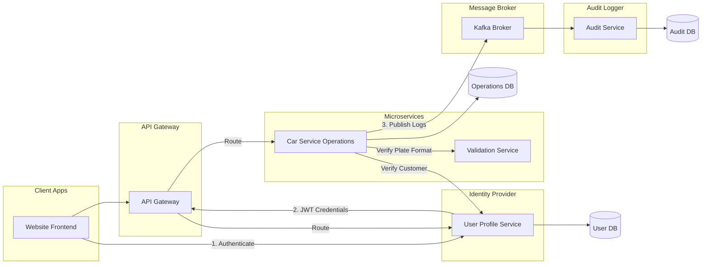

# Car Operations Management System

A highly resilient, secure, and modern microservices-based Car Service Management System. The application manages vehicle service registrations, role-based workflows (Admin, Mechanic, Customer), real-time Kafka auditing, and displays operational metrics through a premium glassmorphic frontend interface.

---

## Technology Stack

### Backend Services
* **Java 21 (JDK 21)**
* **Spring Boot (v3.3.1)**
* **Spring Cloud Routing & Gateway (MVC)**
* **Spring Cloud Netflix Eureka Discovery Server**
* **Spring Cloud OpenFeign (Declarative REST Clients)**
* **Spring Data JPA & Hibernate**
* **MySQL Database**
* **Apache Kafka & ZooKeeper (Event-Driven Logging & Audits)**
* **Springdoc OpenAPI 3 (Swagger UI)**
* **JJWT (Java JWT for Security & Authorization)**

### Frontend Application
* **HTML5 & Vanilla CSS3** (Premium Dark-themed Glassmorphism UI)
* **Vanilla JavaScript** (Reactive State Management, Cached API lookups, and Dynamic Dropdowns)
* **FontAwesome 6.4.0** (Icons)

---

## Microservices Architecture & Layout

The system is split into **6 standalone Maven microservices** communicating over an internal network:



### 1. [eureka-discovery-server](file:///c:/Users/aakri/OneDrive/Pictures/microservices/eureka-discovery-server) (port: 8761)
The central service registry. Every service registers itself here upon startup, enabling dynamic lookup and routing without hardcoded port mappings.

### 2. [api-gateway](file:///c:/Users/aakri/OneDrive/Pictures/microservices/api-gateway) (port: 8765)
The unified edge gateway. It performs the following duties:
* Routes incoming client requests downstream.
* Employs `JwtAuthenticationFilter` to validate JWT tokens.
* Enforces Role-Based Access Control (RBAC) security policies.
* Injects security headers (`X-Authenticated-User`, `X-Authenticated-Role`, `X-Authenticated-Id`) downstream.
* Serves a consolidated Swagger UI aggregating all microservices docs on a single page.
* Houses the `/auth/login` endpoint to verify passwords and issue signed JJWT tokens.

### 3. [user-profile-service](file:///c:/Users/aakri/OneDrive/Pictures/microservices/user-profile-service) (port: 8081)
Manages system user registrations, credentials, and roles.
* Database: `carservice_user_db`
* Passwords are encrypted using SHA-256 with salting and pepper.
* Features a database seeder that automatically creates a default Admin user (`username: admin`, `password: adminpassword`) if the tables are empty on startup.

### 4. [car-service-operations](file:///c:/Users/aakri/OneDrive/Pictures/microservices/car-service-operations) (port: 8082)
The core transactional engine of the application.
* Database: `carservice_ops_db`
* Intercepts incoming requests to file, update, list, and delete vehicle service logs.
* Verifies customer validity via Feign calls to `user-profile-service`.
* Verifies registration formats via Feign calls to `car-details-validation-service`.
* Dispatches asynchronous auditable event payloads to Apache Kafka topics on execution.

### 5. [car-details-validation-service](file:///c:/Users/aakri/OneDrive/Pictures/microservices/car-details-validation-service) (port: 8083)
Enforces national license plate formats.
* Matches values against: `^[A-Z]{2}[0-9]{1,2}[A-Z]{1,2}[0-9]{4}$` (allowing format variants like `DL1CA1234` or `MH12AB1234`).
* Strips spacing and enforces uppercase casing before checking.

### 6. [audit-service](file:///c:/Users/aakri/OneDrive/Pictures/microservices/audit-service) (port: 8084)
An asynchronous event processor.
* Database: `carservice_audit_db`
* Listens to the Kafka topic `car-service-audit-events`.
* Consumes validation outcomes (successes, rejections, deletes, status updates) and writes them as persistent logs to MySQL.

---

## Security, Role Enforcements & Rules

### Database separation (Non-overlapping sequential IDs)
Unlike shared-table designs where IDs overlap between roles, users are split into three dedicated tables:
* `admin_profiles` (Admin ID prefix: `ADM-`)
* `mechanic_profiles` (Mechanic ID prefix: `MCH-`)
* `customer_profiles` (Customer ID prefix: `USR-`)

Each table maintains its own independent auto-increment sequence starting at `1`. For example, `USR-1`, `MCH-1`, and `ADM-1` can coexist with no identifier numbering overlap.

### Role Permissions Matrix

| Feature / Action | Admin | Mechanic | Customer |
| :--- | :---: | :---: | :---: |
| **Register Service Logs (POST)** | [Yes] | [No] | [No] |
| **Delete Service Logs (DELETE)** | [Yes] | [No] | [No] |
| **View All Service Logs (GET)** | [Yes] | [Yes] (Full History) | [No] (Own Only) |
| **View Personal Logs (GET)** | [Yes] | [Yes] | [Yes] (Filtered to own ID) |
| **Update Service Status (PUT)** | [Yes] (Any state) | [Yes] (Active states) | [No] |
| **Revert COMPLETED status** | [Yes] | [No] (Read-Only lock) | [No] |

### Completed State Lock
Once a service record is marked as `COMPLETED` (terminal workshop state):
* **Mechanics** cannot change it. The dropdown is hidden in the UI and replaced with a lock icon, and backend requests to `/status` from a mechanic return `403 Forbidden`.
* **Admins** maintain override control and can revert the status back to any previous state (e.g. `IN_PROGRESS` or `PENDING`) if corrections are required.

---

## Setup & Running Guide

### 1. Prerequisites
Ensure you have the following installed on your machine:
* **Java Development Kit (JDK) 21**
* **MySQL Server** (Running on port `3306` with credentials `username: root`, `password: root`)
* **Apache Kafka** & **ZooKeeper**

### 2. Startup Kafka and ZooKeeper
Start ZooKeeper followed by the Apache Kafka broker. Open a terminal in your Kafka installation directory:

#### On Windows (Command Prompt / PowerShell)
1. Start ZooKeeper in Terminal 1:
   ```cmd
   .\bin\windows\zookeeper-server-start.bat .\config\zookeeper.properties
   ```
2. Start the Kafka broker in Terminal 2:
   ```cmd
   .\bin\windows\kafka-server-start.bat .\config\server.properties
   ```

#### On Linux / macOS
1. Start ZooKeeper in Terminal 1:
   ```bash
   ./bin/zookeeper-server-start.sh ./config/zookeeper.properties
   ```
2. Start the Kafka broker in Terminal 2:
   ```bash
   ./bin/kafka-server-start.sh ./config/server.properties
   ```

Keep both terminals open while running the application.

### 3. Startup the Microservices
In your IDE (e.g. Spring Tool Suite / Eclipse), import all 6 Maven projects. Run them as **Spring Boot App** in the following order:
1. **`eureka-discovery-server`** (Wait for Dashboard to launch on http://localhost:8761)
2. **`user-profile-service`**
3. **`api-gateway`**
4. **`car-details-validation-service`**
5. **`car-service-operations`**
6. **`audit-service`**

### 4. Running the Frontend
1. Open the [car-service-frontend](file:///c:/Users/aakri/OneDrive/Pictures/microservices/car-service-frontend) directory.
2. Double-click the **`index.html`** file to run the web dashboard directly in your browser.
3. Access the portal:
   * **Login as Admin**: `username: admin`, `password: adminpassword`
   * **Register new users** (Mechanics or Customers) using the *User Profiles* tab.

### 5. Accessing Swagger Documentation
To test or interact with endpoints programmatically, open:
[http://localhost:8765/swagger-ui.html](http://localhost:8765/swagger-ui.html)
* Select the service from the dropdown on the top-right corner to toggle API definitions.
* Paste your bearer JWT token into the **Authorize** lock to make authenticated calls.

### 6. Executing Unit Tests
To run unit and integration tests, open a terminal in any microservice directory and execute:
```bash
mvn test
```
All projects contain comprehensive unit tests covering validation checks, mock clients, happy paths, and Edge Case exceptions.
