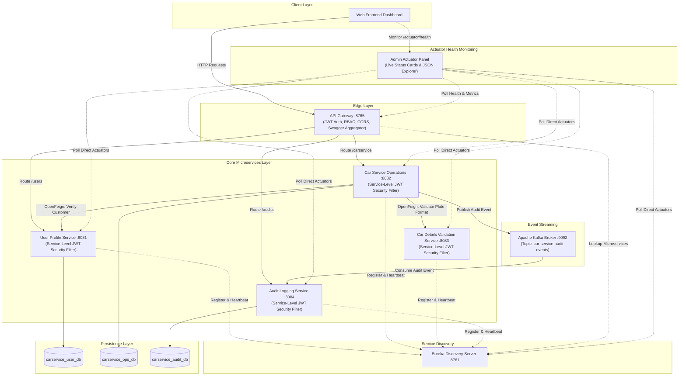

# Car Operations Management System - Architecture Diagram & Layout

This document provides a standalone reference for the microservices architecture, network routing, security layers, and data flow of the Car Operations Management System.

---

## 🎨 System Architecture Graphic

---

## 📊 System Topology & Component Interactions

---

## 🔑 Key Architecture Details

### 1. Dual-Layer Security
* **Layer 1 (API Gateway)**: Validates incoming JWT tokens, handles CORS preflight, enforces RBAC roles (`ADMIN`, `MECHANIC`, `CUSTOMER`), and injects `X-Authenticated-*` headers.
* **Layer 2 (Microservice Level)**: Downstream `ServiceSecurityFilter` and `JwtUtil` validate JWT `Authorization: Bearer <token>` or Gateway context headers. Unauthenticated direct access bypassing Gateway is rejected with `401 Unauthorized`.

### 2. Synchronous REST & Asynchronous Event Streaming
* **Spring Cloud OpenFeign**: `car-service-operations` synchronously verifies user accounts against `user-profile-service` and license plates against `car-details-validation-service`.
* **Apache Kafka**: `car-service-operations` publishes audit events to `car-service-audit-events`, which are consumed asynchronously by `audit-service`.

### 3. Spring Boot Actuator Monitoring
* All 6 microservices expose Spring Boot Actuator health indicators (`db`, `diskSpace`, `ping`, `discoveryComposite`).
* The Web App frontend features an Admin Health & Actuator Panel with live 🟢 **UP** / 🔴 **DOWN** status cards and an interactive JSON Explorer (`/health`, `/metrics`, `/env`, `/beans`, `/mappings`).
